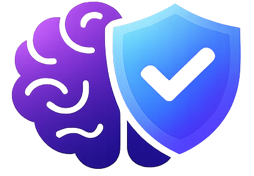
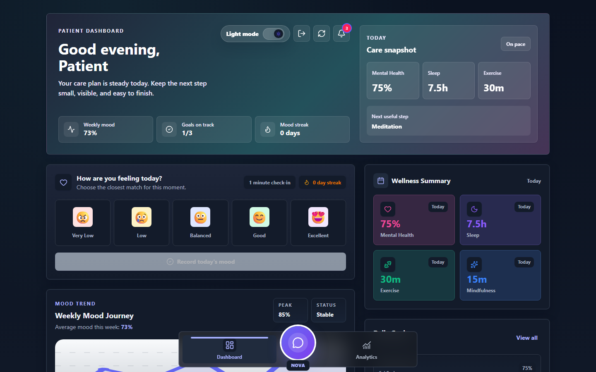
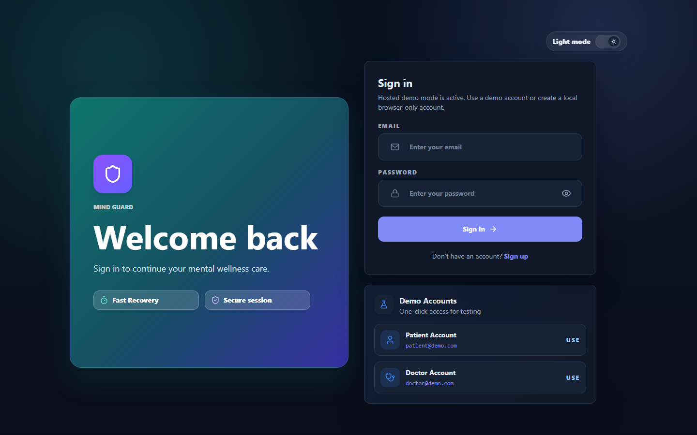
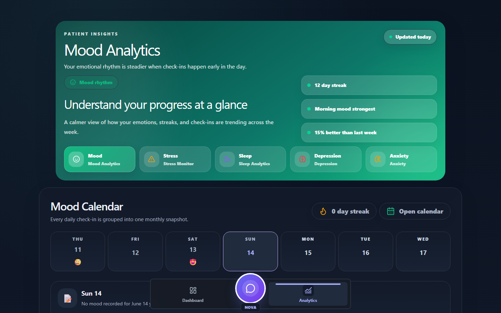
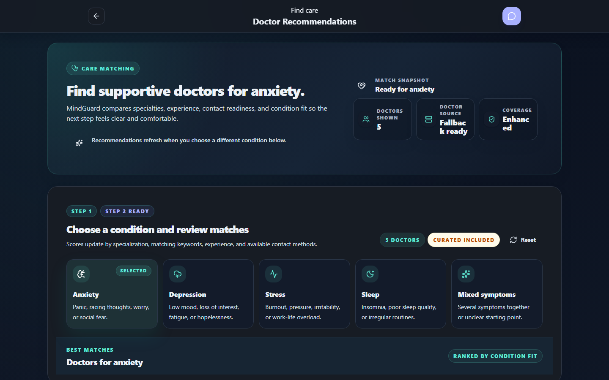
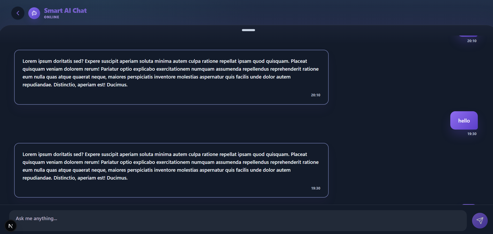
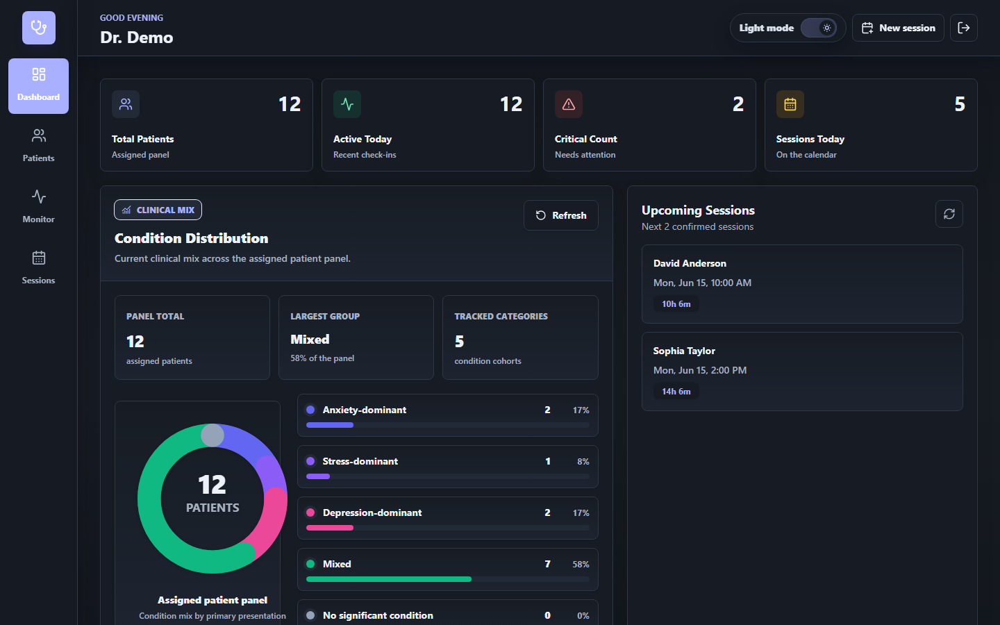
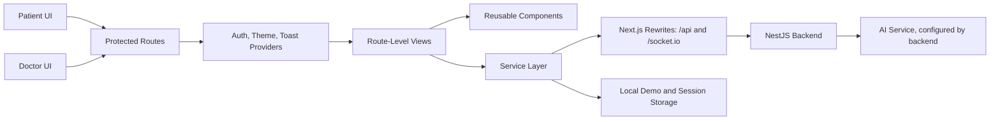

# MindGuard Next.js Frontend

<div align="center">
  

  <h3>A secure mental wellness and care coordination interface for patients and clinicians.</h3>

  <p>
    
    
    
    
    
    
  </p>

  <p>
    <a href="#overview">Overview</a> -
    <a href="#features">Features</a> -
    <a href="#screenshots">Screenshots</a> -
    <a href="#installation">Installation</a> -
    <a href="#usage-guide">Usage Guide</a> -
    <a href="#project-structure">Structure</a> -
    <a href="#roadmap">Roadmap</a>
  </p>
</div>

---

## Overview

MindGuard is a modern mental health support frontend built with **Next.js App Router**, **React**, **TypeScript**, and **Tailwind CSS**. It provides two role-specific experiences:

- **Patients** can track mood, review wellness analytics, use guided wellness tools, receive doctor recommendations, manage appointments, and talk with the support chat.
- **Doctors** can monitor assigned patients, review clinical signals, manage sessions, inspect patient details, and coordinate follow-up care.

The application is designed for a graduation project setting, but its structure follows production-minded frontend patterns: role-protected routes, reusable UI primitives, API service layers, Socket.IO chat integration, demo fallbacks, and responsive dashboard layouts.

> Important: MindGuard is a graduation project and is not a replacement for professional medical advice, diagnosis, emergency response, or clinical judgment.

---

## At A Glance

| Category              | Details                                                              |
| --------------------- | -------------------------------------------------------------------- |
| Project type          | Mental wellness and clinical care coordination frontend              |
| Primary users         | Patients and doctors                                                 |
| Framework             | Next.js 16 App Router                                                |
| Language              | TypeScript                                                           |
| Styling               | Tailwind CSS 4 with custom design tokens                             |
| Realtime layer        | Socket.IO client for chatbot streaming                             |
| Backend integration   | Next.js rewrites proxy `/api` and `/socket.io` to the NestJS backend |
| Demo support          | Local demo accounts and browser-only fallback data                   |
| Default frontend port | `http://localhost:4000`                                              |

---

## Screenshots

<p align="center">
  
</p>

| Sign In                                                                           | Patient Analytics                                                                                       |
| --------------------------------------------------------------------------------- | ------------------------------------------------------------------------------------------------------- |
|  |  |

| Doctor Recommendations                                                                                            | Chat                                                                               |
| ----------------------------------------------------------------------------------------------------------------- | --------------------------------------------------------------------------------------- |
|  |  |

| Doctor Dashboard                                                                               | Responsive Patient Dashboard                                                                                                  |
| ---------------------------------------------------------------------------------------------- | ----------------------------------------------------------------------------------------------------------------------------- |
|  |

---

## Features

### Patient Experience

| Feature               | Description                                                                                                |
| --------------------- | ---------------------------------------------------------------------------------------------------------- |
| Secure authentication | Patient sign in, sign up, session persistence, and protected patient routes.                               |
| Wellness dashboard    | Daily care snapshot, mood check-in, mood streak, wellness summary, goals, appointments, and quick actions. |
| Mood tracking         | Saves mood readings locally or through the backend service, with calendar-based tracking and streak logic. |
| Analytics center      | Mood, stress, anxiety, sleep, and depression analytics with charts, insights, goals, and support actions.  |
| Guided tools          | Breathing exercises, journaling, sleep logs, exercise tracking, daily goals, and recent activity pages.    |
| Doctor matching       | Condition-based doctor recommendations with curated and backend-backed profile support.                    |
| chatbot               | Patient chat interface backed by Socket.IO streaming with local fallback behavior.                         |
| Notifications         | Patient notification drawer for mood reminders, health signals, sleep, activity, and session updates.      |

### Doctor Experience

| Feature               | Description                                                                                  |
| --------------------- | -------------------------------------------------------------------------------------------- |
| Doctor dashboard      | Clinical summary cards, condition distribution, upcoming sessions, and quick actions.        |
| Patient panel         | Assigned patients, severity labels, condition filters, and patient detail flows.             |
| Realtime monitor      | High-risk and moderate alerts based on mood, HRV, sleep, and journal summaries.              |
| Session management    | Create, edit, cancel, review, and start sessions across upcoming, available, and past slots. |
| Care workflow         | Doctor notes, patient notifications, slot status handling, and schedule coordination.        |
| Responsive navigation | Sidebar navigation on desktop and mobile navigation for smaller screens.                     |

---

## Technologies Used

| Layer                  | Technology                                                           |
| ---------------------- | -------------------------------------------------------------------- |
| Framework              | Next.js `16.2.7`                                                     |
| UI library             | React `19.2.7`, React DOM `19.2.7`                                   |
| Language               | TypeScript `5.x`                                                     |
| Styling                | Tailwind CSS `4.x`, custom CSS variables, responsive utility classes |
| Realtime communication | Socket.IO Client `4.2.0`                                             |
| API communication      | Fetch API, local service wrappers, typed response helpers            |
| State and persistence  | React hooks, context providers, local storage session utilities      |
| Quality tools          | ESLint `9`, Prettier `3.8`                                           |
| Package manager        | npm                                                                  |

---

## Architecture

MindGuard keeps user-facing views, reusable components, API services, and typed data models separated so each workflow remains easier to maintain.



### Data Flow Highlights

- Authentication is centralized in `src/services/authService.ts`.
- API requests go through `src/services/apiClient.ts`.
- Chat state and Socket.IO streaming live in `src/services/chatService.ts` and `src/views/patient/chat`.
- Doctor slots and patient records are normalized through dedicated service modules.
- Demo mode and local demo sessions keep the interface usable when the backend is unavailable.

---

## Installation

### Prerequisites

- Node.js `>=20.9.0`
- npm
- Optional: NestJS backend running locally on `http://localhost:3000`
- Optional: AI backend configured through the NestJS backend

### Clone The Repository

```bash
git clone https://github.com/AmmarYasser72/MindGuard_NextJS
cd MindGuard_NextJS
```

### Install Dependencies

```bash
npm install
```

### Configure Environment Variables

Create a local environment file:

```bash
cp .env.example .env.local
```


Use demo mode when you want the frontend to run without relying on backend availability:

```env
NEXT_PUBLIC_DEMO_MODE=true
```

### Run The Development Server

```bash
npm run dev
```

Open:

```text
http://localhost:4000
```

### Production Build

```bash
npm run build
npm run start
```

---

## Available Scripts

| Command                | Description                                           |
| ---------------------- | ----------------------------------------------------- |
| `npm run dev`          | Starts the Next.js development server on port `4000`. |
| `npm run build`        | Creates an optimized production build.                |
| `npm run start`        | Starts the production server on port `4000`.          |
| `npm run lint`         | Runs ESLint across the project.                       |
| `npm run format`       | Formats the codebase with Prettier.                   |
| `npm run format:check` | Checks formatting without changing files.             |

---

## Demo Accounts

| Role    | Email              | Password  | Landing Page         |
| ------- | ------------------ | --------- | -------------------- |
| Patient | `patient@demo.com` | `demo123` | `/patient-dashboard` |
| Doctor  | `doctor@demo.com`  | `demo123` | `/doctor-dashboard`  |

Demo accounts work with local demo sessions. They are useful for screenshots, frontend review, and testing role-based flows without creating new users.

---

## Usage Guide

### Patient Flow

1. Open `/login`.
2. Select the **Patient Account** demo login or sign up as a patient.
3. Review the patient dashboard care snapshot.
4. Record a mood check-in and monitor the streak counter.
5. Open the analytics tab to review mood, stress, anxiety, sleep, and depression insights.
6. Visit doctor recommendations to match with a clinician by condition.
7. Open chatbot for guided support prompts and conversation history.
8. Use wellness tools such as breathing, journaling, exercise, sleep log, goals, and recent activity.

### Doctor Flow

1. Open `/login`.
2. Select the **Doctor Account** demo login or sign up as a doctor.
3. Review the clinical dashboard and condition distribution.
4. Open the patient panel to inspect assigned patients.
5. Use the realtime monitor to review critical and moderate alerts.
6. Create or edit sessions from the sessions workflow.
7. Save notes and session changes so patients can receive updated care notifications.

---

## Key Functionalities

| Area                     | Implementation Notes                                                                                     |
| ------------------------ | -------------------------------------------------------------------------------------------------------- |
| Role protection          | `ProtectedRoute` guards patient and doctor pages based on the authenticated user role.                   |
| Session persistence      | `src/services/session.ts` stores auth state under a local storage prefix.                                |
| Backend proxying         | `next.config.mjs` rewrites frontend `/api` and `/socket.io` calls to the backend target.                 |
| Remote and fallback auth | Auth first uses backend endpoints, then falls back to local demo behavior when appropriate.              |
| Chat resilience          | Chat loads remote messages when available and falls back to locally stored messages when disconnected.   |
| Mood calendar            | Mood entries are normalized into calendar cells, streak calculations, labels, highlights, and summaries. |
| Doctor slots             | Slot services support available slots, booked sessions, cancellation, update notifications, and sorting. |
| Recommendation engine    | Doctor recommendations combine selected patient conditions with backend or curated doctor profiles.      |

---

## Project Structure

```text
mindguard-nextjs/
  app/
    doctor-dashboard/              Doctor dashboard route
    doctor-recommendations/        Patient doctor matching route
    doctor-signup/                 Doctor registration route
    intro/                         Introductory onboarding route
    login/                         Sign in route
    patient-chat/[userId]/         patient chatbot route
    patient-dashboard/             Patient dashboard route
    signup/                        Patient registration route
    splash/                        Splash route
    globals.css                    Global styles and design tokens
    layout.tsx                     Root app layout
    page.ts                        Root redirect to splash
  docs/
    screenshots/                   README screenshot gallery
  public/
    assets/icons/                  Local icon assets
    favicon.png                    MindGuard brand image
    manifest.json                  PWA metadata
  src/
    components/
      auth/                        Authentication UI components
      common/                      Buttons, cards, charts, modals, icons, toast
      doctor/                      Doctor dashboard and session components
      patient/                     Patient cards, navigation, recommendations
    config/                        Demo mode configuration
    data/                          Static dashboard, analytics, doctor, and auth data
    hooks/                         Auth, router, recommendations, dismissable layers
    providers/                     Auth, theme, and app providers
    services/                      API, auth, chat, patient, doctor, slots, readings
    types/                         Shared TypeScript types
    utils/                         Shared utility functions
    views/                         Route-level patient, doctor, and auth screens
```

---

## Environment And Backend Notes

The frontend is designed to cooperate with a local NestJS backend while still supporting demo workflows.

| Variable                      | Purpose                                                                             |
| ----------------------------- | ----------------------------------------------------------------------------------- |
| `NEXT_PUBLIC_API_BASE_URL`    | Public API base used by the frontend. Defaults to `/api`.                           |
| `NEXT_PUBLIC_BACKEND_URL`     | Public backend URL used for Socket.IO and backend-aware flows.                      |
| `NEXT_PUBLIC_SOCKET_BASE_URL` | Optional explicit Socket.IO host. Empty means infer from backend or current origin. |
| `BACKEND_PROXY_TARGET`        | Server-side rewrite target for `/api` and `/socket.io`.                             |
| `NEXT_PUBLIC_DEMO_MODE`       | Enables local browser-only demo behavior when set to `true`.                        |

The frontend does not call the AI backend directly. Configure AI service access from the NestJS backend, for example:

```env
AI_SERVER_URL=http://localhost:8000
```

---

## Challenges And Solutions

| Challenge                         | Solution                                                                                                  |
| --------------------------------- | --------------------------------------------------------------------------------------------------------- |
| Backend availability during demos | Added local demo sessions, curated fallback data, and local storage persistence.                          |
| Role-specific complexity          | Split patient and doctor workflows into route-level views and reusable role-specific components.          |
| Realtime chat reliability         | Combined backend chat history, Socket.IO streaming, and local fallback messages.                          |
| Clinical data readability         | Designed dashboards around summaries, severity states, trends, and concise action areas.                  |
| Responsive dashboard density      | Used adaptive grids, bottom navigation for patient mobile views, and desktop side navigation for doctors. |
| Appointment state changes         | Normalized slot creation, editing, cancellation, and patient notification payloads in services.           |

---


Recommended review focus:

- Authentication and protected-route redirects
- Patient and doctor demo logins
- Socket.IO fallback behavior
- Responsive dashboard layouts
- Form validation and error states
- Accessibility labels on interactive controls

---

## Roadmap

- Add end-to-end tests for patient and doctor critical flows.
- Add unit tests around services, auth fallbacks, mood streaks, and slot normalization.
- Expand accessibility testing with keyboard and screen reader checks.
- Add backend-driven analytics charts for production patient data.
- Improve multilingual support for English and Arabic experiences.
- Add production-ready error monitoring and analytics.
- Add stronger clinical audit trails for doctor actions.
- Improve PWA offline support for mood journaling and wellness tools.

---

## Contributors

| Name         | Role                                  |
| ------------ | ------------------------------------- |
| Ammar Yasser | Project author and frontend developer |

Contributions, issues, and improvement ideas can be added through the repository workflow chosen by the project owner.

---

## License

This project is licensed under the **MIT License**. See [LICENSE](LICENSE) for details.

---

<div align="center">
  <strong>MindGuard</strong>
  <br />
  Built to make mental wellness tracking and doctor-patient coordination clearer, calmer, and more accessible.
</div>
